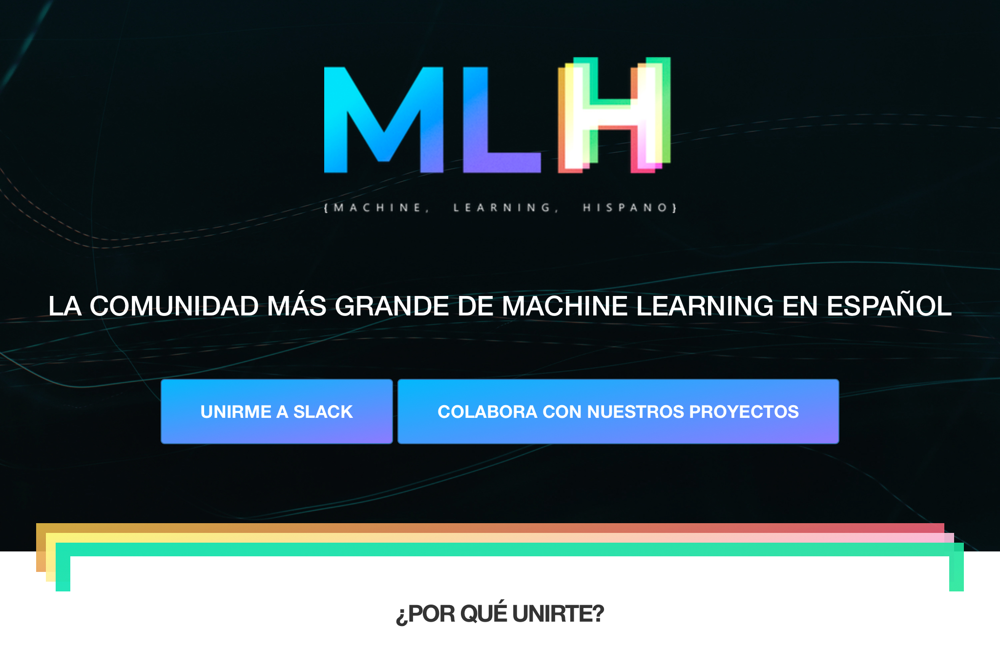
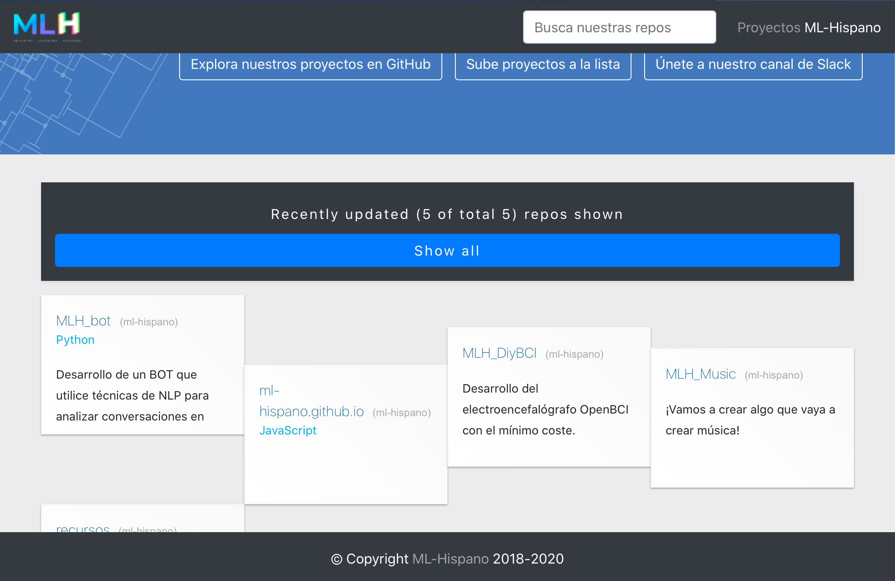

# ML-Hispano 

Únete la comunidad **Machine Learning Hispano** la comunidad más grande en habla hispana. Si tu también quieres formar parte de esta comunidad, entra a nuestro Slack a través del botón rosa o en este link [Slack ML-Hispano](https://bit.ly/3cfWqL8).

# Comunidad ML-Hispano
Este repositorio se representa en línea en [Comunidad ML-Hispano](http://machinelearninghispano.com).

# MLH Web Site

# Proyectos

# Documentación

